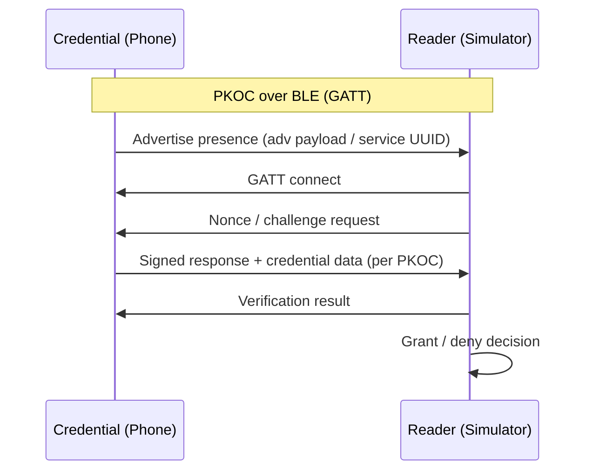
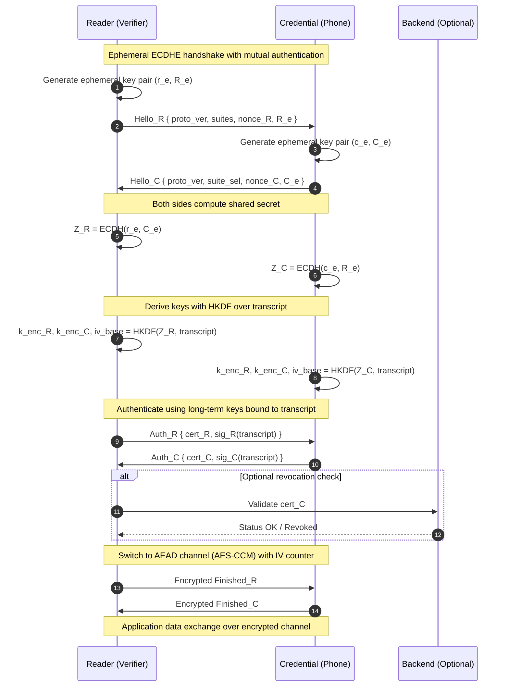
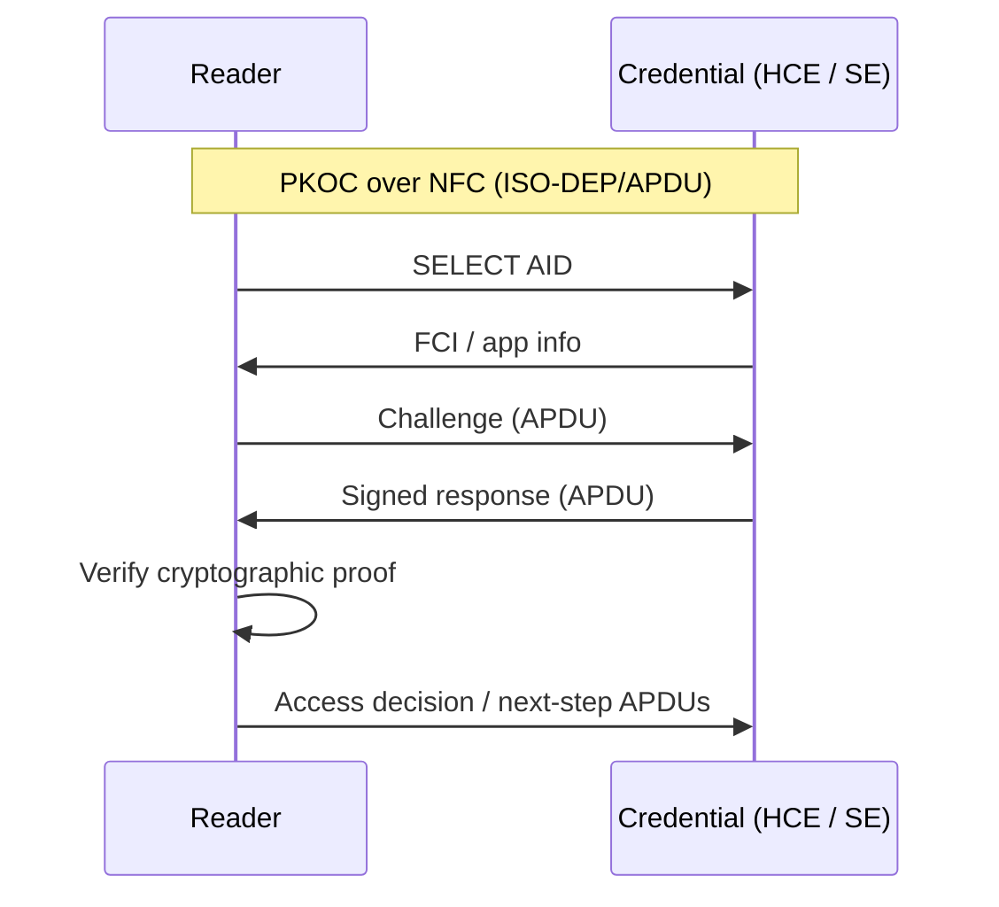

# PKOC Mobile Credential Suite

A multi-platform, open-source codebase implementing the **PKOC** (Public Key Open Credential) protocol across **Android** and **iOS**.  
This repo hosts three apps that enable secure, interoperable identity exchange over **Bluetooth Low Energy (BLE)** and **Near Field Communication (NFC)**.

[](https://github.com/psialliance-org/com-psia-pkoc/actions/workflows/ios-build-test.yml)
[](https://github.com/psialliance-org/com-psia-pkoc/actions/workflows/android-build-test.yml)
[](https://github.com/psialliance-org/com-psia-pkoc/actions/workflows/simulator-build-test.yml)
## Repository Layout

```
.
├── android/          # Android Mobile Credential (Java) — BLE + NFC via HCE
├── simulator/        # Android Reader Simulator (Java) — BLE + NFC for debug & enrollment
├── ios/              # iOS Mobile Credential (Swift) — BLE + NFC via Secure Element
└── README.md
```

## What is PKOC?

**PKOC** (Public Key Open Credential) is an open standard for mobile credentials with strong cryptographic verification, privacy-preserving design, and cross-vendor interoperability over BLE and NFC.

> Learn more at the PSIA site and PKOC working group materials.

## Feature Matrix

| Component              | Platform | Transport           | Highlights                                                                  |
|------------------------|----------|---------------------|------------------------------------------------------------------------------|
| **Mobile Credential**  | Android  | BLE, NFC (HCE)      | Advertises credential over BLE; HCE-based NFC flow; AES-CCM; secure storage |
| **Reader Simulator**   | Android  | BLE, NFC            | Emulates PKOC reader; enrollment tools; verbose logging & message tracing    |
| **Mobile Credential**  | iOS      | BLE, NFC (SE)       | BLE credentialing; NFC via Secure Element (requires entitlements)           |

## Quick Start

### 1) Android Mobile Credential (`android/`)

**Requirements**
- Android Studio (2022.3+ recommended)
- JDK 11+
- Physical device with BLE + NFC

**Build & Install**
```bash
cd android
./gradlew assembleDebug
adb install app/build/outputs/apk/debug/app-debug.apk
```

**Run**
- Enable **NFC** and **Bluetooth** on the device.
- Launch the app; follow on-screen steps to provision a test credential.

### 2) Android Reader Simulator (`simulator/`)

**Requirements**
- Android Studio (2022.3+ recommended)
- JDK 11+
- Physical device with BLE + NFC (different device than the credential phone)

**Build & Install**
```bash
cd simulator
./gradlew assembleDebug
adb install app/build/outputs/apk/debug/app-debug.apk
```

**Run**
- Enable **NFC** and **Bluetooth**.
- Use the app to scan for credentials via BLE and/or present the phone to NFC for APDU exchange.
- Use the **Enrollment** and **Logs** screens to validate message flows.

### 3) iOS Mobile Credential (`ios/`)

**Requirements**
- Xcode 15+
- iOS 16+ device with BLE + NFC
- Apple Developer account
- NFC/SE entitlements as required by your target flow

**Build & Run**
1. Open `ios/` in Xcode.
2. Set your **Signing Team**.
3. Build & run on a **physical device** (NFC doesn’t work in the simulator).
4. Ensure BLE and NFC are enabled in iOS Settings.

## Architecture at a Glance

### BLE Credential Flow (high level)

### PKOC ECDHE Perfect Forward Secrecy Flow



### NFC/APDU Flow (high level)


## Security & Cryptography

- **Cryptography:** AES-CCM and asymmetric key operations per PKOC guidance.  
- **Key Storage:** Platform-secure storage primitives (e.g., Android Keystore, iOS Secure Enclave / Keychain).  
- **NFC Paths:**
  - Android: **HCE** service for ISO-DEP/APDU.
  - iOS: Secure Element / NFC (requires appropriate entitlements and provisioning).

> ⚠️ **Production Hardening:** Replace any demo keys, disable debug logging, enforce certificate/attestation checks, and review PKOC + mobile OS security best practices before deployment.

## Testing

- Use the **Reader Simulator** to:
  - Validate BLE advertisement, GATT sessions, and message timing.
  - Exercise NFC APDU sequences and inspect responses.
  - Run **enrollment** flows to provision credentials and verify round-trips.

- Suggested scenarios:
  - BLE only, NFC only, mixed handoff.
  - Offline vs online verification modes (if implemented).
  - Negative tests: wrong nonce, corrupted frames, replay attempts.

## Building Blocks (Developer Notes)

- **Android (Credential & Simulator):**
  - BLE: scan/advertise, GATT service characteristics for PKOC messages.
  - NFC (Credential): HCE service declaration, APDU routing, foreground dispatch if applicable.

- **iOS (Credential):**
  - BLE: CoreBluetooth central/peripheral roles as needed.
  - NFC: SE/NFC flows gated by entitlements and device support.

## Contributing

Contributions are welcome!

1. Fork the repo  
2. Create a feature branch  
   ```bash
   git checkout -b feature/your-awesome-change
   ```
3. Commit with clear messages  
4. Open a Pull Request describing the rationale and testing steps

Please keep changes modular and add tests or logs where appropriate.

## License

This project is released under the **MIT License**. See [`LICENSE`](LICENSE) for details.

## Contact

- Open an **Issue** for bugs and feature requests.  
- Coordinate protocol questions with your PKOC working group contacts.