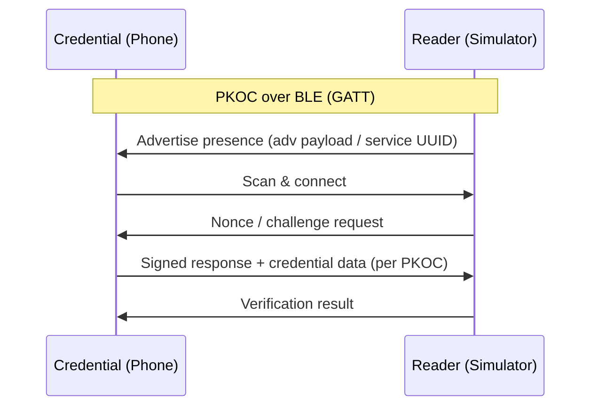
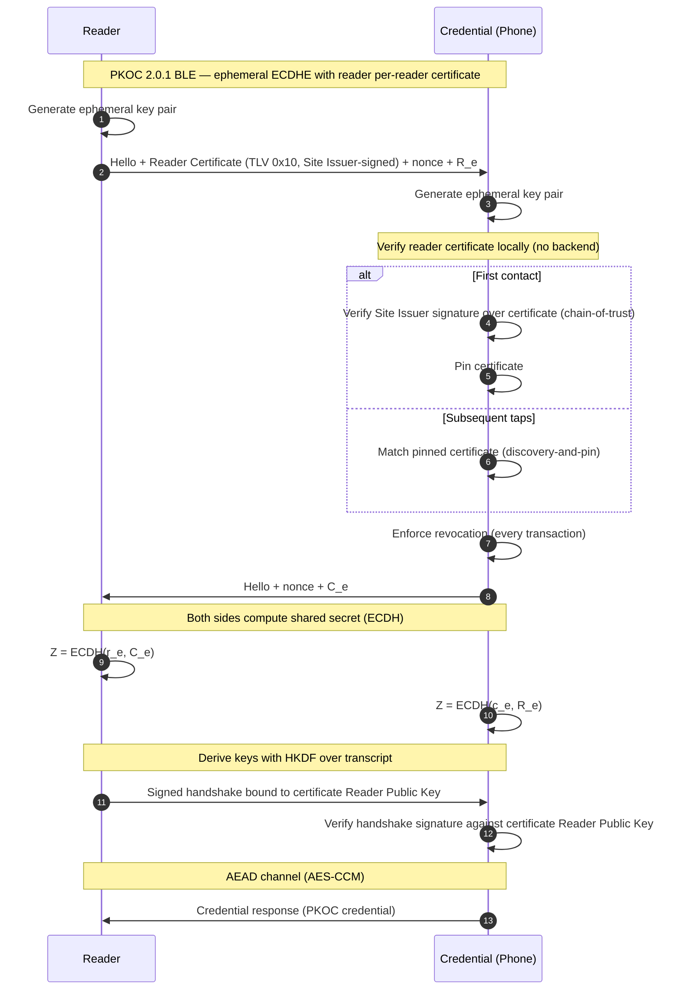
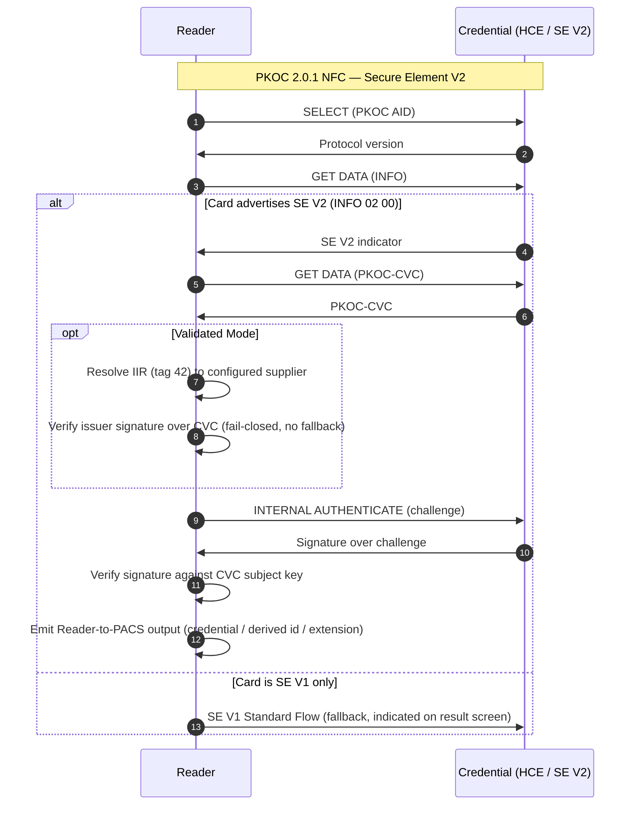

# PKOC Mobile Credential Suite

A multi-platform, open-source codebase implementing the **PKOC** (Public Key Open Credential) protocol across **Android** and **iOS**.  
This repo hosts three apps that enable secure, interoperable identity exchange over **Bluetooth Low Energy (BLE)** and **Near Field Communication (NFC)**.

### Build & Test Pipelines
[](https://github.com/psialliance-org/com-psia-pkoc/actions/workflows/ios-build-test.yml)
[](https://github.com/psialliance-org/com-psia-pkoc/actions/workflows/android-build-test.yml)

### Release/Test Pipelines
[](https://github.com/psialliance-org/com-psia-pkoc/actions/workflows/ios-testflight-release.yml)
[](https://github.com/psialliance-org/com-psia-pkoc/actions/workflows/android-apk-release.yml)

## Repository Layout

```
.
├── android/          # Android Mobile Credential (Java) — BLE + NFC via HCE
├── simulator/        # Android Reader Simulator (Java) — BLE + NFC for debug & enrollment
├── ios/              # iOS Mobile Credential (Swift) — BLE + NFC via Secure Element
└── README.md
```

## What is PKOC?

**PKOC** (Public Key Open Credential) is an open standard for mobile credentials with strong cryptographic verification, privacy-preserving design, and cross-vendor interoperability over BLE and NFC.

> Learn more at the PSIA site and PKOC working group materials.

## Feature Matrix

| Component              | Platform | Transport           | Highlights                                                                  |
|------------------------|----------|---------------------|------------------------------------------------------------------------------|
| **Mobile Credential**  | Android  | BLE, NFC (HCE)      | BLE ECDHE PFS with per-reader certificate (v2.0.1); NFC HCE with SE V2 Validated Mode; AES-CCM; secure storage |
| **Reader Simulator**   | Android  | BLE, NFC            | Emulates PKOC reader; per-reader cert + SE V2 Validated Mode; multi-supplier config; enrollment tools; verbose logging |
| **Mobile Credential**  | iOS      | BLE, NFC (SE)       | BLE credentialing; NFC via Secure Element (requires entitlements)           |

## PKOC 2.0.1 — Validated Mode

The Android apps implement PKOC **2.0.1 Validated Mode** across both transports. Validated Mode is an upgrade over the baseline flows: where the reader previously trusted a credential or reader on presentation alone, it now cryptographically verifies a certificate against a provisioned trust anchor before completing the transaction. Baseline (Standard / v1.x) flows remain supported, and the apps fall back to them gracefully when a peer does not support Validated Mode.

### BLE — Per-Reader Certificate (Reader → Credential)

- The reader presents a **Reader Certificate** (fixed 138-byte structure, `TLV 0x10`) carrying its public key, signed by a **Site Issuer** key.
- The credential verifies the Site Issuer signature over the certificate against a provisioned Site Issuer trust anchor (chain-of-trust), then binds the ECDHE handshake to the certificate's Reader Public Key.
- Trust model is **discovery-and-pin**: the full certificate chain is verified on first contact, then the certificate is pinned for subsequent taps. Revocation is enforced on every transaction, including pinned ones.
- On-device indicators show the outcome: the reader displays a Validated Mode banner, and the credential indicates whether trust was established by chain verification (first contact) or by pin.

### NFC — Secure Element V2 (SE V2)

- Reader drives the SE V2 sequence: `SELECT` → **GET DATA (INFO)** → **GET DATA (PKOC-CVC)** → **INTERNAL AUTHENTICATE**.
- The credential presents a **PKOC-CVC** (Card Verifiable Certificate). In Validated Mode the reader resolves the certificate's Issuer Identification Reference (IIR, tag `42`) to a configured supplier and verifies the issuer signature before authenticating.
- **Standard vs Validated:** Validated Mode requires a matching supplier and does not fall back after a validation failure. If the tapped card does not advertise SE V2 at all, the reader falls back to the SE V1 Standard Flow and indicates the fallback on the result screen.
- The reader result screen surfaces the Reader-to-PACS output (credential / derived identifier / extension) alongside the subject public key.

### Multi-Supplier Trust Model

- Reader trust is keyed by **IIR**, so multiple credential suppliers can be trusted simultaneously; migrating suppliers is adding the incoming IIR and retiring the outgoing one.
- The Reader Simulator provides a **PKOC Credential Suppliers** screen to add/retire suppliers by IIR (EC P-256 issuer public key), with Validated Mode and validity-enforcement toggles.
- Suppliers can be provisioned by scanning a **supplier QR** exported from the credential app, or entered manually.

## Quick Start

### 1) Android Mobile Credential (`android/`)

**Requirements**
- Android Studio (2022.3+ recommended)
- JDK 11+
- Physical device with BLE + NFC

**Build & Install**
```bash
cd android
./gradlew assembleDebug
adb install app/build/outputs/apk/debug/app-debug.apk
```

**Run**
- Enable **NFC** and **Bluetooth** on the device.
- Launch the app; follow on-screen steps to provision a test credential.

### 2) Android Reader Simulator (`simulator/`)

**Requirements**
- Android Studio (2022.3+ recommended)
- JDK 11+
- Physical device with BLE + NFC (different device than the credential phone)

**Build & Install**
```bash
cd simulator
./gradlew assembleDebug
adb install app/build/outputs/apk/debug/app-debug.apk
```

**Run**
- Enable **NFC** and **Bluetooth**.
- Use the app to scan for credentials via BLE and/or present the phone to NFC for APDU exchange.
- Use the **Enrollment** and **Logs** screens to validate message flows.

### 3) iOS Mobile Credential (`ios/`)

**Requirements**
- Xcode 15+
- iOS 16+ device with BLE + NFC
- Apple Developer account
- NFC/SE entitlements as required by your target flow

**Build & Run**
1. Open `ios/` in Xcode.
2. Set your **Signing Team**.
3. Build & run on a **physical device** (NFC doesn’t work in the simulator).
4. Ensure BLE and NFC are enabled in iOS Settings.

## Architecture at a Glance

### BLE Credential Flow (high level)

```mermaid
sequenceDiagram
    participant C as Credential (Phone)
    participant R as Reader (Simulator)
    Note over C,R: PKOC over BLE (GATT)
    R->>C: Advertise presence (adv payload / service UUID)
    C->>R: Scan & connect
    R->>C: Nonce / challenge request
    C->>R: Signed response + credential data (per PKOC)
    R->>C: Verification result
```

### BLE Validated Mode — ECDHE PFS + Per-Reader Certificate (v2.0.1)


```mermaid
sequenceDiagram
    autonumber
    participant R as Reader
    participant C as Credential (Phone)

    Note over R,C: PKOC 2.0.1 BLE — ephemeral ECDHE with reader per-reader certificate

    R->>R: Generate ephemeral key pair
    R->>C: Hello + Reader Certificate (TLV 0x10, Site Issuer-signed) + nonce + R_e
    C->>C: Generate ephemeral key pair

    Note over C: Verify reader certificate locally (no backend)
    alt First contact
        C->>C: Verify Site Issuer signature over certificate (chain-of-trust)
        C->>C: Pin certificate
    else Subsequent taps
        C->>C: Match pinned certificate (discovery-and-pin)
    end
    C->>C: Enforce revocation (every transaction)
    C->>R: Hello + nonce + C_e

    Note over R,C: Both sides compute shared secret (ECDH)
    R->>R: Z = ECDH(r_e, C_e)
    C->>C: Z = ECDH(c_e, R_e)

    Note over R,C: Derive keys with HKDF over transcript
    R->>C: Signed handshake bound to certificate Reader Public Key
    C->>C: Verify handshake signature against certificate Reader Public Key

    Note over R,C: AEAD channel (AES-CCM)
    C->>R: Credential response (PKOC credential)
```

### NFC SE V2 Flow (v2.0.1)

```mermaid
sequenceDiagram
    autonumber
    participant R as Reader
    participant C as Credential (HCE / SE V2)

    Note over R,C: PKOC 2.0.1 NFC — Secure Element V2

    R->>C: SELECT (PKOC AID)
    C->>R: Protocol version
    R->>C: GET DATA (INFO)
    alt Card advertises SE V2 (INFO 02 00)
        C->>R: SE V2 indicator
        R->>C: GET DATA (PKOC-CVC)
        C->>R: PKOC-CVC
        opt Validated Mode
            R->>R: Resolve IIR (tag 42) to configured supplier
            R->>R: Verify issuer signature over CVC (fail-closed, no fallback)
        end
        R->>C: INTERNAL AUTHENTICATE (challenge)
        C->>R: Signature over challenge
        R->>R: Verify signature against CVC subject key
        R->>R: Emit Reader-to-PACS output (credential / derived id / extension)
    else Card is SE V1 only
        R->>C: SE V1 Standard Flow (fallback, indicated on result screen)
    end
```

## Deep Links (Universal Links / App Links)

The apps use deep links to handle organization invite flows. When a user taps a link like `https://<host>/share/<inviteCode>`, the app opens directly to the consent screen.

The default host is `mobile.opencredential.sentryinteractive.com`. You can change it to your own domain.

### Server-side setup

Your deep link host must serve two verification files so that iOS and Android can associate the link with your app.

**iOS** -- `https://<host>/.well-known/apple-app-site-association`

```json
{
  "applinks": {
    "apps": [],
    "details": [
      {
        "appID": "<TEAM_ID>.<BUNDLE_ID>",
        "paths": ["/share/*"]
      }
    ]
  }
}
```

Replace `<TEAM_ID>` with your Apple Team ID and `<BUNDLE_ID>` with your app's bundle identifier (default: `com.elatec.pkoc`).

**Android** -- `https://<host>/.well-known/assetlinks.json`

```json
[
  {
    "relation": ["delegate_permission/common.handle_all_urls"],
    "target": {
      "namespace": "android_app",
      "package_name": "<APPLICATION_ID>",
      "sha256_cert_fingerprints": ["<YOUR_SIGNING_CERT_SHA256>"]
    }
  }
]
```

Replace `<APPLICATION_ID>` with your Android application ID (default: `com.psia.pkoc`) and `<YOUR_SIGNING_CERT_SHA256>` with the SHA-256 fingerprint of your signing certificate. For debug builds, get it with:

```bash
keytool -list -v -keystore ~/.android/debug.keystore -alias androiddebugkey -storepass android
```

For release builds, use your release keystore instead.

### Changing the deep link host

If you want to use a different domain, update the following files:

**Android** -- `android/credential/src/main/AndroidManifest.xml`

Change the `android:host` attribute in the `ConsentActivity` intent filter:

```xml
<data
    android:scheme="https"
    android:host="your.domain.com"
    android:pathPrefix="/share/" />
```

**iOS** -- `ios/Sources/PSIAExperienceApp.entitlements`

Change the associated domain:

```xml
<key>com.apple.developer.associated-domains</key>
<array>
    <string>applinks:your.domain.com</string>
</array>
```

### Debug vs Release

- **Android**: App Links verification (`android:autoVerify="true"`) requires the `assetlinks.json` file to be accessible over HTTPS on your domain. During debug, if you haven't set up the server file, links will show a disambiguation dialog instead of opening the app directly. The app will still work once the user selects it.
- **iOS**: Universal Links require the `apple-app-site-association` file on the server for both debug and release builds. During development, you can add `applinks:your.domain.com?mode=developer` to your entitlements to use the Apple CDN's developer mode, which refreshes the association more frequently.

## Security & Cryptography

- **Cryptography:** AES-CCM and asymmetric key operations per PKOC guidance.  
- **Key Storage:** Platform-secure storage primitives (e.g., Android Keystore, iOS Secure Enclave / Keychain).  
- **NFC Paths:**
  - Android: **HCE** service for ISO-DEP/APDU.
  - iOS: Secure Element / NFC (requires appropriate entitlements and provisioning).

> ⚠️ **Production Hardening:** Replace any demo keys, disable debug logging, enforce certificate/attestation checks, and review PKOC + mobile OS security best practices before deployment.

## Testing

- Use the **Reader Simulator** to:
  - Validate BLE advertisement, GATT sessions, and message timing.
  - Exercise NFC APDU sequences and inspect responses.
  - Run **enrollment** flows to provision credentials and verify round-trips.

- Suggested scenarios:
  - BLE only, NFC only, mixed handoff.
  - Offline vs online verification modes (if implemented).
  - Negative tests: wrong nonce, corrupted frames, replay attempts.

## Building Blocks (Developer Notes)

- **Android (Credential & Simulator):**
  - BLE: scan/advertise, GATT service characteristics for PKOC messages.
  - NFC (Credential): HCE service declaration, APDU routing, foreground dispatch if applicable.

- **iOS (Credential):**
  - BLE: CoreBluetooth central/peripheral roles as needed.
  - NFC: SE/NFC flows gated by entitlements and device support.

## Contributing

Contributions are welcome!

1. Fork the repo  
2. Create a feature branch  
   ```bash
   git checkout -b feature/your-awesome-change
   ```
3. Commit with clear messages  
4. Open a Pull Request describing the rationale and testing steps

Please keep changes modular and add tests or logs where appropriate.

## License

This project is released under the **MIT License**. See [`LICENSE`](LICENSE) for details.

## Contact

- Open an **Issue** for bugs and feature requests.  
- Coordinate protocol questions with your PKOC working group contacts.
